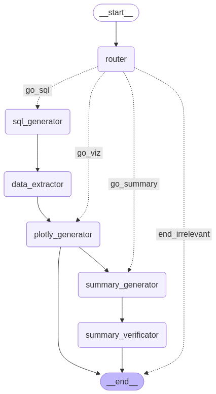

# Talk to Your Data

is an interactive data exploration tool that allows users to query their data using natural language. By leveraging Python, small/large language models, and agent-based workflows, the system interprets user questions and executes corresponding data analysis tasks automatically.

## Features

- **Natural Language Interface:** Interact with your data by simply asking questions.
- **LLM-Powered Query Parsing:** Uses LMs (e.g., llama, qwen, chatGPT or claude models) to interpret and transform natural language queries into actionable tasks.
- **Agent-Based Architecture:** Modular agents handle data ingestion, cleaning, visualization, and analysis.
- **Interactive Visualizations:** Generate charts and reports dynamically based on user queries.

## Schema[WIP]
[](data/images/schema.png)

## Installation

1. **Clone the repository:**
   ```bash
   git clone https://github.com/dnlgsv/talk2data.git
   cd talk2data
   ```
